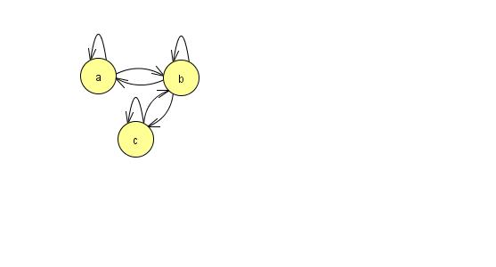
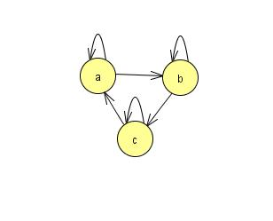
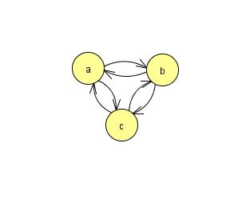
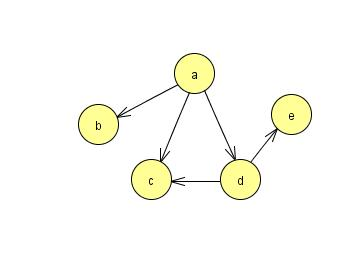
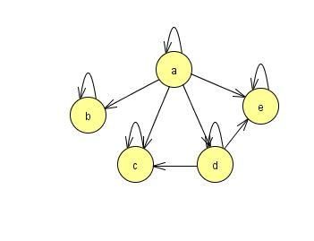

# Übung 2
## Aufgabe 1: Wie man aus einer Fliege einen Elefanten macht!
**Wir beweisen folgende Aussage durch Induktion über n:**

*Ist von n Tieren eines ein Elefant, dann sind alle diese Tiere Elefanten.*

**Induktionsanfang $n=1$: Hat man nur ein Tier und ist dieses ein Elefant, so sind
alle diese Tiere Elefanten. Induktionsschritt $n \rightarrow n+1$: Gegeben seien also $n+1$
Tiere $T_1, . . . ,T_{n+1}$, von denen das erste ein Elefant sei. Wenden wir die
Induktionsvoraussetzung auf die ersten n dieser Tiere an, so erhalten wir, dass
 $T_1, . . . ,T_n$ Elefanten sind. Nun nehmen wir $T_{n+1}$, dies sei die Fliege, hinzu
 und lassen eines der anderen Tiere weg. Nach Induktionsvoraussetzung können wir
 schließen, dass auch diese Tiere alle Elefanten sind. Also sind alle $T_1, . . . ,T_{n+1}$,
 auch die Fliege, Elefanten. Oder etwa nicht? Wo liegt der Fehler?**

 Im Fall $n+1=2$ kann man den Elefanten zwar so stellen, daß er bei den ersten $n=1$ Tieren steht. Folglich sind alle Tiere unter den ersten $n=1$ Tieren Elefanten. Aber deshalb befinden sich unter den "letzten" $n$ Tieren nicht notwendig Elefanten.

Der Induktionsschluß würde nur für $n>1$ funktionieren, denn nur dann können aus einem Elefanten zwei (oder mehr) werden und ist damit auch ein Elefant unter den letzten $n$ Tieren.
Die Induktionsvoraussetzung war aber gezeigt für $n=1$.
Man müßte also zunächst zeigen, daß von zwei Tieren, von denen eines ein Elefant ist, auch das andere ein Elefant ist. Aber das wird schwer.

---
## Aufgabe 2:
**(a) Seien A und B Mengen. $B^A$ bezeichne die Menge aller Funktionen von A nach B.
Geben Sie eine ” natürliche Bijektion“ zwischen $\{0,1\}^A$, also der Menge aller
Funktionen von A nach {0,1}, und $2^A$, also der Potenzmenge von A, an.**

**(b) Erläutern Sie folgende Fußnote aus dem Buch <i>Elements of the Theory of Computation:
True fundamentalists would see the ordered pair (a,b) not as a new kind of object,
but as identical to $\{a,\{a,b\}\}$.**

ist hier die Untermenge gemeint? also dass (a,b) eine untermenge von (a,(a,b)) darstellt? für teil a hilft vllt cantorsche Paarungsfunktion?

---
## Aufgabe 3:

  *Reflexiv:*
  $\forall a \in A:(a,a) \in R$

  *Symmetrie:*
  $\forall a,b \in A:(a,b)\in R \Rightarrow (b,a)\in R$

  *Transitivität:*
  $\forall a,b,c \in A:aRb \land bRc \Rightarrow aRc$

* **a) Geben Sie eine Relation an, die reflexiv und symmetrisch ist, aber nicht transitiv.**

 $R=\{(a,a),(b,b),(c,c),(a,b),(b,a),(b,c),(c,b)\}$
 

* **b) Geben Sie eine Relation an, die reflexiv und transitiv ist, aber nicht symmetrisch.**

 $R=\{(a,a),(b,b),(c,c),(a,b),(b,c),(a,c)\}$

 

 *[@cyberkeiler] (ac) Relation im Bild falschherum gezeichnet!*

* **c) Geben Sie eine Relation an, die symmetrisch und transitiv ist, aber nicht reflexiv.**

 $R=\{(a,b),(b,a),(b,c),(c,b),(a,c),(c,a)\}$

 

* **(d) Bestimmen Sie die reflexive transitive Hülle** $R^*$ **der Relation** $R = \{(a,b),(a,c),(a,d),(d,c),(d,e)\}$.
**Zeichnen Sie die Darstellung von R als gerichteter Graph. Ebenso für** $R^*$.

 $R=\{(a,b),(a,c),(a,d),(d,c),(d,e)\}$

 

 $R^*=\{(a,a),(b,b),(c,c),(d,d),(e,e),(a,b),(a,c),(a,d),(a,e),(d,c),(d,e)\}$
 
 

  *[@belkinot]  was ist mit a,e ?*

  *[@cyberkeiler] Habe es in $R^*$ eingefügt!*

---
## Aufgabe 4:
**Sei A eine endliche Menge. Zeigen Sie $|2^A| = 2^{|A|}$.**
<<<<<<< Updated upstream:Übung 02/Übung 02.md
=======

$|A|=n \text{Anz. der Elemente}$
$\begin{pmatrix}

\end{pmatrix}$
>>>>>>> Stashed changes:Übung 02/Übung 02.md

---
## Aufgabe 5:
Beweisen oder widerlegen Sie: $\forall L1,L2 : (L1L2 \cup L1)^* = L1(L2L1 \cup L1)^*$

Gegenbeispiel:

  $\begin{matrix}
 L_1=\{a\}     & L_2=\{b\}     \\
 L_1L_2=\{ab\} & L_2L_1=\{ba\} \\
 L_1L_2\cup L_1=\{a,ab\} & L_2L_1\cup L_1=\{a,ba\} \\
 (L_1L_2\cup L_1)^*=\{\varepsilon , a, ab, ...\} & (L_2L_1\cup L_1)^*=\{\varepsilon , a, ba, ...\} \\
  & L_1(L_2L_1\cup L_1)^*=\{a, ba, ...\}
 \end{matrix}$

 $\Rightarrow (L1L2 \cup L1)^* \neq L1(L2L1 \cup L1)^*$

---
## Aufgabe 6:
* **(a) Beweisen Sie, dass die Menge der Wörter über einem Alphabet abzählbar unendlich ist.**

      Für alle Alphabete gilt sie sind abzählbar.
      d.h. injektiv und surjektiv -> f :

  $\sum$ -> $N$ und $\forall a \in \sum \exist l \in N$

      Beispiel: $\sum = \{a,b,c\}$
      Ordnung a<b<c
      ε  a  b  c  aa  ab  ac  ba  bb ....
      1  2  3  4  5   6   7   8   9  ....

<<<<<<< Updated upstream:Übung 02/Übung 02.md
* **(b) Beweisen Sie, dass die Menge der Sprachen über einem Alphabet überabzählbar unendlich ist.**
=======
<<<<<<< HEAD:Übung 02/Übung 02
* (b) Beweisen Sie, dass die Menge der Sprachen über einem Alphabet überabzählbar unendlich ist.
=======
* **(b) Beweisen Sie, dass die Menge der Sprachen über einem Alphabet überabzählbar unendlich ist.**
>>>>>>> origin/master:Übung 02/Übung 02.md
>>>>>>> Stashed changes:Übung 02/Übung 02.md
      Siehe R zu N ist überabzählbar, Cantorsches Verfahren/Diagonalverfahren.
      Alle Zahlen zwischen 0 und 1 aufschreiben, dann bei der n-ten zahl die n-te nachkommastelle nichit übereinstimmen --> neue Zahl geschaffen
      Bsp:
      Zahl 1    0,5324
      Zahl 2    0,4356
      Zahl 3    0.8432
      Zahl 4    0.9342

      Neue Zahl: 0,4218 (4 ungleich 5, 2 ungleich 3, 1 ungleich 3 und 8 ungleich 2)
      http://www.mathe-online.at/mathint/zahlen/i_Rueberabz.html
---
## Aufgabe 7:
**Sei $\sum = \{a,b\}$ und sei L induktiv wie folgt definiert:**
* (1) ε gehört zu L.
* (2) Falls x ∈ L ist, dann gehört auch axb zu L.
* (3) Falls x ∈ L ist, dann gehört auch bxa zu L.
* (4) Falls x ∈ L und y ∈ L, dann gehört auch xy zu L.

**Zeigen Sie, dass alle Wörter in L gleichviele a and b enthalten.**

Beweis durch struktuelle Induktion:

IA: $ \varepsilon \in L, |\varepsilon|_a=|\varepsilon|_b=0$

IV: $x,y \in L, |x|_a=|x|_b, |y|_a=|y|_b$

IB:
* 1) $axb \in L, |axb|_a=|axb|_b, \text{da } w=axb$

 $|w|_a=|axb|_a=1+|x|_a=1+|x|_b=(\text{laut IV})|axb|_b=|w|_b$

* 2) $bxa \in L, |bxa|_a=|bxa|_b \rightarrow \text{analog zu 1)}$
* 3) $xy \in L, |xy|_a=|xy|_b$

 $|xy|_a=|x|_a+|y|_a=(\text{laut IV})|x|_b+|y|_b=|xy|_b$

---
## Aufgabe 8:
Beweisen Sie: Jeder ungerichtete Graph mit mehr als einem Knoten besitzt zwei Knoten vom gleichen Grad.

