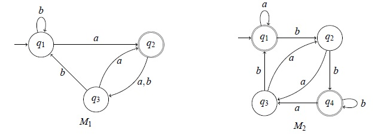
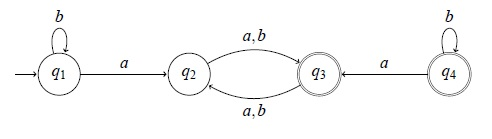
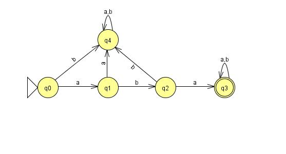
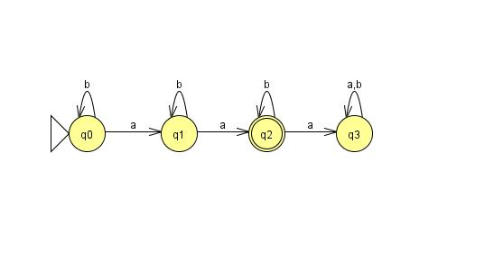
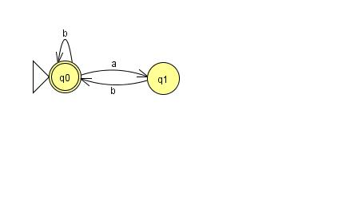
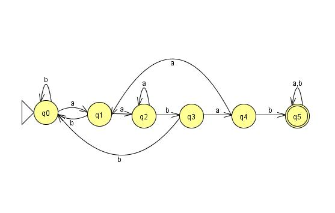
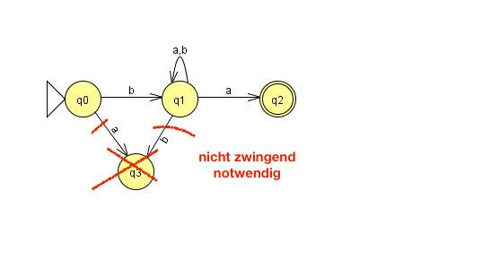
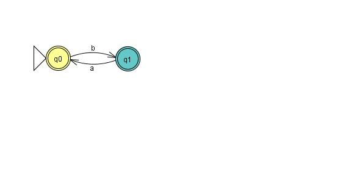

# Übung 3
## Aufgabe 1:
**Beweisen oder widerlegen Sie folgende Behauptung über Sprachen: $ \forall L_1, L_2, L_3: L_1 (L_2 - L_3) = L_1 L_2-L_1 L_3$ **

Gegenbeispiel: $L_1=\{b,bb\}; L_2=\{a,ba\}; L_3=\{a\}$

---

## Aufgabe 2:
**Gegeben seien die folgenden Zustandsübergangsdiagramme endlicher Automaten M1 und M2:

Geben Sie formale Beschreibungen der Automaten M1 und M2 an.
Beantworten Sie die folgenden Fragen für jeden der beiden Automaten:**

* **a) Was ist die Folge der Zustände, die bei Eingabe aabb erreicht werden?**

 $M_1:q1\rightarrow q2 \rightarrow q3 \rightarrow q1\rightarrow q1$

 $M_2:q1\rightarrow q1\rightarrow q1\rightarrow q2\rightarrow q4$

* **b) Wird das Wort aabb akzeptiert?**

 $M_1$ Nein, $q2$ ist kein Endzustand

 $M_2$ Ja, $q4$ ist gültiger Endzustand

* **c) Wird das leere Wort $\epsilon$ akzeptiert?**

 Nur bei $M_2$ da Startzustand $q1$ auch Endzustand

 ---

## Aufgabe 3:
 Sei M durch folgendes Zustandsübergangsdiagramm gegeben. Was ist L(M)? Beweisen Sie ihre Antwort!
 

 ---

## Aufgabe 4:
Geben Sie deterministische endliche Automaten an, die die folgenden Sprachen akzeptieren:
 * a) $\{w \in \{a,b\}^* | w \text{ beginnt mit aba}\}$
 

 * b) $\{w \in \{a,b\}^* |w \text{ enthaelt genau 2 a}\}$
  

---

## Aufgabe 5:
Geben Sie deterministische endliche Automaten an, die die folgenden Sprachen akzeptieren:
 * a) $\{w \in \{a,b\}^* | \text{ in w folgt auf jedes a unmittelbar ein b}\}$
  

 * b) $\{w \in \{a,b\}^* | w \text{ enthaelt das Teilwort aabab}\}$
 

 ---

## Aufgabe 6:
Geben Sie jeweils (nichtdeterministische) endliche Automaten an, die die folgenden Sprachen akzeptieren:
 * a) $\{w \in \{a,b\}^* | w \text{ beginnt mit b und endet mit a}\}$
  

 * b) $\{w \in \{0,7\}^* | w \text{ enthaelt das Teilwort 007}\}$
 

 ---

## Aufgabe 7:
Geben Sie jeweils (nichtdeterministische) endliche Automaten an, die die folgenden Sprachen akzeptieren:

 * a) $\{w \in \{a,b\}^* | |w| \leq 3\}$
  
 * b) $\{w \in \{a,b\}^* | w \text{an jeder ungeraden Position in w steht ein b}\}$
  
