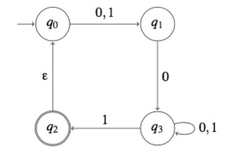
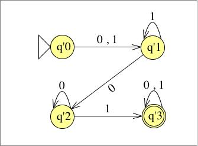
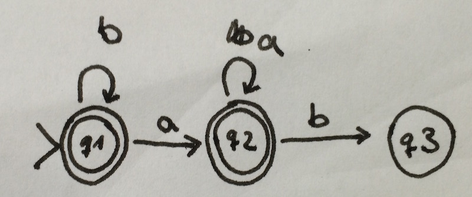
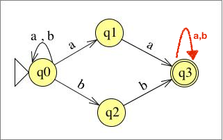
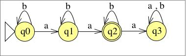
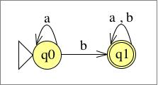
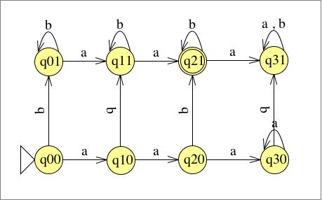

# Übung 4
## Aufgabe 1:
**Konstruieren Sie mit dem Verfahren aus dem Beweis der Äquivalenz von NEA und DEA zu dem nichtdeterministischen endlichen Automaten, der durch das folgende Zustandsübergangsdiagramm gegeben ist, einen äquivalenten deterministischen Automaten. Sie brauchen dabei nicht alle Zustände, die sich aus der Potenzmengenkonstruktion ergeben, zu konstruieren, sondern nur die vom Startzustand aus erreichbaren.**

$NEA = (\{q_0,...,q_3\}, \{0,1\}, \Delta, q_0, \{q_3\})$

| $\Delta$ | | 0 | 1 |
| --- | --- | :---: | :---: |
| $q_0$ | | $q_1$ | $q_1$ |
| $q_1$ | | $q_2$ | $\emptyset $ |
| $q_2$ | | $q_2$ | $\{q_2,q_3\}$ |
| $q_3$ | | $\emptyset$ | $\emptyset$ |

| $\Delta \rightarrow \delta$ | | 0 | 1 |
| --- | --- | :---: | :---: |
| $q'_0$ | | $q'_1$ | $q'_1$ |
| $q'_1$ | | $q'_2$ | $q'_1$ |
| $q'_2$ | | $q'_2$ | $q'_3$ |
| $q'_3$ | | $q'_3$ | $q'_3$ |

*DEA in 3 Schritten:*
1. Zustände mit $\epsilon$ erreichbar:

| $q$ | $q_0$ | $q_1$ | $q_2$ | $q_3$ |
| :---: | --- | --- | ---- | ---- |
| $E(q)$ | {$q_0$} | {$q_1$} | {$q_0, q_2$}  | {$q_3$}

2. Eingabe 0,1 unter Hülle:

| $\delta$ | {$q_0$} | {$q_1$} | {$q_2$} | {$q_3$} |
| :---: | --- | --- | ---- | ---- |
| $0$ | {$q_1$} | {$q_3$} | $\emptyset$  | {$q_3$} |
| $1$ | {$q_1$} | $\emptyset$  | $\emptyset$   | {$q_0, q_2, q_3$} |
3. irgendwas

 K = {$q_0, q_1, q_2, q_3$}

| $\delta*$ | {$q_0$} | {$q_1$} | {$q_3$} | $\emptyset$ | {$q_0, q_2, q_3$}   | {$q_1, q_3$}   | K   |
| :---: | --- | --- | ---- | ---- |
| $0$ | {$q_1$} | {$q_3$} | {$q_3$}  | $\emptyset$ | {$q_1, q_3$} | {$q_3$} | {$q_1, q_3$}
| $1$ | {$q_1$} | $\emptyset$  | {$q_0, q_2, q_3$}   | $\emptyset$ | {$q_0, q_1, q_2, q_3$} | {$q_0, q_1, q_3$} | K
4. Startzustand ist Epsilonhülle von $q_o$ $E(q_0)$
$$s=\{q_0\}$$
5. Endzustand alle die, die Ursprungs-Endzustand $q_2$ beinhalten
$$F = \{ \{q_0, q_2, q_3\}, \{q_0, q_1, q_2, q_3\}\}$$

---
## Aufgabe 2:
**Geben Sie jeweils Zustandsübergangsdiagramme (nichtdeterministischer) endlicher Automaten an, die die folgenden Sprachen akzeptieren:**
* a) $\{w \in \{a,b\}^* | w \text{ enthaelt das Teilwort ab nicht}\}$

* b) $\{w \in \{a,b\}^* | w \text{ enthaelt das Teilwort aa oder das Teilwort bb}\}$

---
## Aufgabe 3:
**Geben Sie das Zustandsübergangsdiagramm eines deterministischen endlichen Automaten an, der die Sprache $\{w \in \{a,b\}^* | w \text{ enthaelt genau zwei a und mindestens ein b}\}$ akzeptiert. Die Sprache ist der Schnitt zweier einfacherer Sprachen. Konstruieren Sie zunächst deterministische endliche Automaten für diese Sprachen und kombinieren Sie dann die beiden Automaten wie in der Vorlesung angegeben.**

**Def. Schnitt zweier Sprachen:**
* Sein $M_1=(K_1,\Sigma_1,\delta_1,s_1,F_1)$ und $M_2=(K_2,\Sigma_2,\delta_2,s_2,F_2)$ deterministische endliche Automaten mit $K_1 \cap K_2=\emptyset$.

 Sei $M=(K,\Sigma,\delta,s,F)$ mit
 * $K=K_1 \times K_2$
 * $s=(s_1,s_2)$
 * $F=F_1 \times F_2$

 und $\delta((q_1,q_2),\sigma)=(\delta_1(q_1,\sigma),\delta_2(q_2,\sigma))$.

* Dann gilt: $L(M)=L(M_1)\cap L(M_2)$  

Die einzelnen Bedingungen werden in 2 unabhängigen Automaten umgesetzt.

| $q_i$ | | a | b |
| --- | --- | :---: | :---: |
| $q_0$ | | $q_1$ | $q_0$ |
| $q_1$ | | $q_2$ | $q_1$ |
| $q_2$ | | $q_3$ | $q_2$ |
| $q_3$ | | $q_3$ | $q_3$ |

| $q_j$ | | a | b |
| --- | --- | :---: | :---: |
| $q_0$ | | $q_0$ | $q_1$ |
| $q_1$ | | $q_1$ | $q_1$ |

$q_{ij}=(q_i,q_j): $

| $q_{ij}$ | | a | b |
| --- | --- | :---: | :---: |
| $q_{00}$ | | $q_{10}$ | $q_{01}$ |
| $q_{01}$ | | $q_{11}$ | $q_{01}$ |
| $q_{10}$ | | $q_{20}$ | $q_{11}$ |
| $q_{11}$ | | $q_{21}$ | $q_{11}$ |
| $q_{20}$ | | $q_{30}$ | $q_{21}$ |
| $q_{21}$ | | $q_{31}$ | $q_{21}$ |
| $q_{30}$ | | $q_{30}$ | $q_{31}$ |
| $q_{31}$ | | $q_{31}$ | $q_{31}$ |
---
## Aufgabe 4:
**Sei $\Sigma=\{a,b,c\}$. Geben Sie reguläre Ausdrücke für die folgenden Sprachen an. Sie dürfen dabei wie in der Vorlesung angegeben Klammern einsparen.**
* a) $\{w \in \Sigma^* | w \text{ endet mit b}\}$

 $L(((a \cup b \cup c)^* b))$

 $= L((a \cup b \cup c)^* )L(b)$

 $= L((a \cup b \cup c)^* )\{b\}$

 $= (L(a) \cup L(b) \cup L(c))^* \{b\}$

 $= (\{a\} \cup \{b\} \cup \{c\})^* \{b\}$

 $= \{a,b,c\}^* \{b\}$

* b) $\{ w \in \Sigma^* | w \text{ enthaelt das Teilwort ab}\}$

 $L(((a \cup b \cup c)^* ab (a \cup b \cup c)^* ))$

 $= L((a \cup b \cup c)^* ))L(ab)L((a \cup b \cup c)^* ))$

 $= L((a \cup b \cup c)^* ))\{ab\}L((a \cup b \cup c)^* ))$

 $= (L(a) \cup L(b) \cup L(c))^* )\{ab\}(L(a) \cup L(b) \cup L(c))^* )$

 $= (\{a\} \cup \{b\} \cup \{c\})^* \{ab\}(\{a\} \cup \{b\} \cup \{c\})^* $

 $= \{a,b,c\}^* \{ab\} \{a,b,c\}^* $

---
## Aufgabe 5:
**Sei $\Sigma = \{a,b\}$. Geben Sie reguläre Ausdrücke für die folgenden Sprachen an. Sie dürfen dabei wie in der Vorlesung angegeben Klammern einsparen.**

* a) $\{ w \in \Sigma^* | \text{ das Wort bab ist ein Praefix von w}\}$

 $L((bab)(a \cup b)^* )$

 $= L(bab)L((a \cup b)^* )$

 $= \{bab\}(L(a) \cup L(b))^* $

 $= \{bab\}(\{a\} \cup \{b\})^* $

 $= \{bab\}\{a,b\}^* $

* b) $\{ w \in \Sigma^* | w \text{ enthaelt hoestens zwei a}\}$

 $L((b)^* (a) (b)^* (a) (b)^* )$

 $= L((b)^* ) L(a) L((b)^* ) L(a) L((b)^* )$

 $= L((b)^* ) \{a\} L((b)^* ) \{a\} L((b)^* )$

 $= (L(b)^* ) \{a\} (L(b)^* ) \{a\} (L(b)^* )$

 $= \{b\}^* \{a\} \{b\}^* \{a\} \{b\}^* $

---
## Aufgabe 6:
**Zeigen Sie, dass die Sprache $\{a^mb^k | m\leq k\}\subseteq \{a,b\}^*$ nicht regulär ist.**

*Definition Pumping Lemma: *
(in Klausur am Besten in Text mit einflechten)
* $\forall L \in REG$
* $\exists n \in N, n >= 0$
* $\forall w \in L, |w| >= 0$
* $\exists x,y,z \in \sum^*: w=xyz, y \neq \epsilon, |xy| <= n$,
* $\forall i >= 0: xy^iz \in L$

Angenommen L ist regulär, so erfüllt L die Aussage des Pumping Lemma (für reguläre Sprachen). Es sei n eine nat. Zahl wie im Pumping Lemma, dann ist $w=a^nb^n \in L$.

$|a^nb^n|=2n>=n$. Also existieren x,y,z, sodass $w=xyz; y\neq \epsilon; |xy|<=n$. Also $xy=a^k, k<=n;$

$y^l, 1<=l<=k$
Wir suchen i>=0, sodass $xy^iz \notin L$, dh. $a^{k-l}()$

---
Für jede Zerlegung $w=xyz$ mit $|y|\geq1$ und $|xy|<p$ so gilt $y \in \{a\}^* $.

Daraus folgt aber $xy^2z=a^{p+|y|}b^p \notin L$ was in Widerspruch zur Aussage des Pumping Lemma steht.

---
Falls die Sprache regulär wäre, müsste das Pumping Lemma gelten, also:
* $x=\varepsilon$
* $y=a$
* $z=bb$

Pumpe y auf: $xyz=\varepsilon a^kbb$
Es wäre nach dem Lemma das Wort aaaabb möglich, nach der Spreche jedoch nicht.

---

Beweis durch Widerspruch (ein Wort wählen)

Ang.: $L$ wäre regulär.
Wir wählen $$

---
## Aufgabe 7:
**Zeigen Sie, dass die Sprache $\{ww^R | w \in \{a,b\}^*\}$ nicht regulär ist.**
