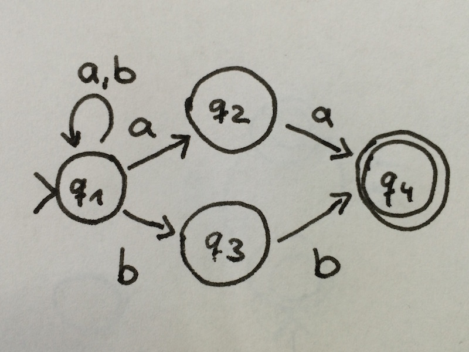

# Übung 4
## Aufgabe 1:
**Konstruieren Sie mit dem Verfahren aus dem Beweis der Äquivalenz von NEA und DEA zu dem nichtdeterministischen endlichen Automaten, der durch das folgende Zustandsübergangsdiagramm gegeben ist, einen äquivalenten deterministischen Automaten. Sie brauchen dabei nicht alle Zustände, die sich aus der Potenzmengenkonstruktion ergeben, zu konstruieren, sondern nur die vom Startzustand aus erreichbaren.**

---
## Aufgabe 2:
**Geben Sie jeweils Zustandsübergangsdiagramme (nichtdeterministischer) endlicher Automaten an, die die folgenden Sprachen akzeptieren:**
* a) $\{w \in \{a,b\}^* | w \text{ enthaelt das Teilwort ab nicht}\}$

* b) $\{w \in \{a,b\}^* | w \text{ enthaelt das Teilwort aa oder das Teilwort bb}\}$

---
## Aufgabe 3:
**Geben Sie das Zustandsübergangsdiagramm eines deterministischen endlichen Automaten an, der die Sprache $\{w \in \{a,b\}^* | w \text{ enthaelt genau zwei a und mindestens ein b}\}$ akzeptiert. Die Sprache ist der Schnitt zweier einfacherer Sprachen. Konstruieren Sie zunächst deterministische endliche Automaten für diese Sprachen und kombinieren Sie dann die beiden Automaten wie in der Vorlesung angegeben.**

---
## Aufgabe 4:
**Sei $\Sigma=\{a,b,c\}$. Geben Sie reguläre Ausdrücke für die folgenden Sprachen an. Sie dürfen dabei wie in der Vorlesung angegeben Klammern einsparen.**
* a) $\{w \in \Sigma^* | w \text{ endet mit b}\}$

 $L(((a \cup b \cup c)^* b))$

 $= L((a \cup b \cup c)^* )L(b)$

 $= L((a \cup b \cup c)^* )\{b\}$

 $= (L(a) \cup L(b) \cup L(c))^* \{b\}$

 $= (\{a\} \cup \{b\} \cup \{c\})^* \{b\}$

 $= \{a,b,c\}^* \{b\}$

* b) $\{ w \in \Sigma^* | w \text{ enthaelt das Teilwort ab}\}$

 $L(((a \cup b \cup c)^* ab (a \cup b \cup c)^* ))$

---
## Aufgabe 5:
**Sei $\Sigma = \{a,b\}$. Geben Sie reguläre Ausdrücke für die folgenden Sprachen an. Sie dürfen dabei wie in der Vorlesung angegeben Klammern einsparen.**

* a) $\{ w \in \Sigma^* | \text{ das Wort bab ist ein Praefix von w}\}$

 $w \{bab\}\{a,b\}^* $

 $L(bab)L(\{a,b\}^* ) \rightarrow L(bab)L(a\lor b)^* $

 $L(bab (a \lor b)^* ) \rightarrow bab(a\lor b)^* $

* b) $\{ w \in \Sigma^* | w \text{ enthaelt hoestens zwei a}\}$

$$

---
## Aufgabe 6:
**Zeigen Sie, dass die Sprache $\{a^mb^k | m\leq k\}\subseteq \{a,b\}^*$ nicht regulär ist.**

---
## Aufgabe 7:
**Zeigen Sie, dass die Sprache $\{ww^R | w \in \{a,b\}^*\}$ nicht regulär ist.**
