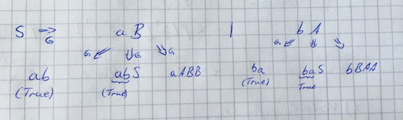

# Übung 5

## Aufgabe 1:
**Sei $\Sigma = \{a,b\}$. Geben Sie reguläre Ausdrücke für die folgenden Sprachen an. Sie dürfen dabei wie
in der Vorlesung angegeben Klammern einsparen.**
* (a) $\{w \in \Sigma^* | w \text{ enthaelt geradzahlig viele a}\}$

 $(b^* a b^* a b^* )^*$
* (b) $\{w \in \Sigma^* | \text{ in w gibt es genau ein Vorkommen des Teilwortes aaa}\}$

 $((ab)^*(aab)^*b^*)^* aaa ((ab)^* (aab)^* b^*)^*$

---
## Aufgabe 2:
**Geben Sie einen (nichtdeterministischen) endlichen Automaten, der die Sprache $L(a^*bb^*(a \cap b)ab^*)$ akzeptiert. Zustandsübergangsdiagramm genügt. Dabei ist es hilfreich, dem die Abschlusseigenschaften regulärer Sprachen ausnutzenden Beweis aus der Vorlesung zu folgen, Sie müssen dies aber nicht tun.**

---
## Aufgabe 3:
**Beweisen oder widerlegen Sie: $\{www | w \in \{a,b\}^*\}$ ist eine reguläre Sprache.**

---
## Aufgabe 4:
**Beweisen oder widerlegen Sie: $\{xyx^R | x,y \in \{a,b\}^*\}$ ist eine reguläre Sprache.**

---
## Aufgabe 5:
**Welche der folgenden Aussagen sind wahr, welche falsch? Begründen Sie jeweils ihre Antwort!**
* (a) **Jede Teilmenge einer regulären Sprache ist eine reguläre Sprache.**
 
 Falsch, $L=\{a,b\}^* \rightarrow L=\{w|w\in \{a,b\}^*\}$
* (b) **Falls L eine reguläre Sprache ist, so ist die Sprache $L^R=\{w^R | w \in L\}$ ebenfalls regulär.**

 Wahr, Automat von L kann in $L^R$ umgewandelt werden(Anfangszustand = Endzustand , Endzustand = Anfangszustand, Pfeile umkehren für NEA)
* (c) **Für jede reguläre Sprache L gibt es einen NEA mit genau einem Endzustand.**

 Wahr, im NEA werden alle Endzustände zu einem unter Eingabe von Epsilon zu einem Eindzustand geführt. 
* (d) **Falls $L \subseteq \Sigma^*$ regulär ist, dann ist auch $\{w | w \in L \land w \in L^R\}$ regulär.**

 Wahr, $L^{\cap}=L\cap L^R$

---
## Aufgabe 6:
**Geben Sie eine rechtslineare Grammatik an, die die Sprache $L(a^*bba^*)$ erzeugt.**

$G=(\{S,B,C\},\{a,b\},\{S \rightarrow aS|aB, B \rightarrow bbA, A \rightarrow aA|A\}, S)$

---
## Aufgabe 7:
**Sei $\Sigma = \{a,b\}$ und sei $G=(V, \Sigma , R, S)$ eine kontextfreie Grammatik, wobei $V=\{S,A,B\}$ und
$R=\{S \rightarrow aB | bA, A \rightarrow a | aS | BAA, B \rightarrow b | bS | ABB\}$.**
* (a) **Zeigen Sie, dass ababbaaabb zu L(G) gehört.**
 $S \Rightarrow_G aB \Rightarrow_G abS \Rightarrow_G abaB \Rightarrow_G ababS$

 $\Rightarrow_G ababbA \Rightarrow_G ababbaS \Rightarrow_G ababbaaB$

 $\Rightarrow_G ababbaaABB \Rightarrow_G ababbaaabb$
* (b) **Zeigen Sie, dass alle Wörter in L(G) gleichviele a und b enthalten.**

 Die Aussage ist richtig, kann es aber nicht vollständig beweisen.
 
 Brauche noch den Beweis von:

 $|ABB|_ b=|ABB|_ a-1$ und  $|BAA|_ a = |BAA|_ b-1$

---
## Aufgabe 8:
**Geben Sie eine kontextfreie Grammatik an, die die Sprache $\{aubw | u,w \in \{a,b\} , |u|=|w|\}$ erzeugt.**

$G=(\{S,B,C\},\{a,b\},\{S \rightarrow aB, B \rightarrow aC|bc|b, C \rightarrow aB|bB\}, S)$
